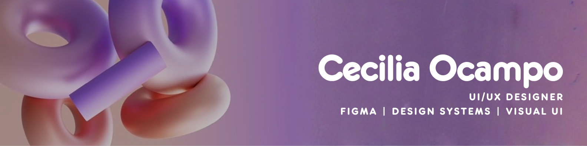

Sobre mí

Diseñadora UI/UX junior apasionada por crear interfaces claras, funcionales y visualmente coherentes. Actualmente estoy finalizando un bootcamp de UX/UI donde he desarrollado proyectos end-to-end desde investigación de usuarios hasta prototipos interactivos y design systems en Figma.

Me interesa especialmente el diseño de producto digital, la organización de interfaces y la creación de experiencias simples que resuelvan problemas reales. Disfruto trabajar en entornos colaborativos, iterar a partir de feedback y seguir aprendiendo herramientas que conecten diseño y tecnología.

Actualmente busco mi primera oportunidad profesional como UI/UX Designer junior en equipos remotos donde pueda aportar valor visual, seguir creciendo y participar en proyectos reales de producto.

Tecnologías y herramientas

Figma
Wireframing
Prototyping
Design Systems
UX Research
Responsive Design
HTML y CSS básico

Contacto

Portafolio: https://www.figma.com/design/ySXSWUFxMAKnZokR51USDh/Projects-UX-UI---CECILIA-OCAMPO-%7C-C-9?m=auto&t=Re9OboVsUIGYJvY2-1

LinkedIn: https://www.linkedin.com/in/cecilia--ocampo/

Correo: ceyocampo@hotmail.com
